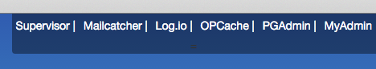

Userscripts / GreaseMonkey
==========================

Goal
----

Userscripts are JS scripts used to enrich pages.
The script format is based on [GreaseMonkey](http://www.greasespot.net/), available as a Firefox addon, native in Chrome. 

Installation
------------

**In Firefox**, head to [`about:addons`](about:addons), install GreaseMonkey addon, open tab 'User Scripts', then drag&drop script in page

**In Chrome**, head to [`chrome://extensions`](chrome://extensions), then drag&drop the script.

Update
------
Vicious... Drag&drop again the script in installation page, and... you're done

Scripts
-------

The first (and only one) is elao.user.js, which purpose is to add useful toolbar in Elao's projects.
Toolbar is default hidden, with just a discreet grey handler. Move your mouse over the handler, it appears :)

