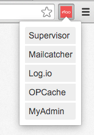

# Elao Symfony Standard Extension

This Chrome extension allow you to display a list of enabled service in your browser interface (so you won't have to remember that your bdd io is port 1979)

## Next

- Release this as an extension on the chrome store
- Make this compatible with firefox
- Add configuration for the list of tools
- Add a refresh button to clear the cache
